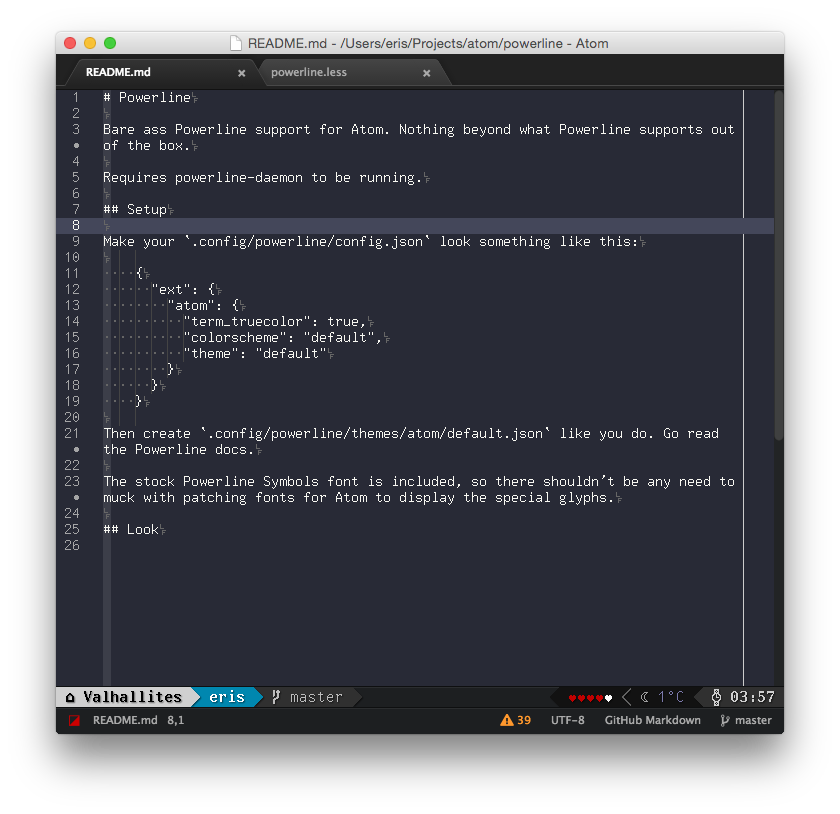

# Powerline

Bare ass Powerline support for Atom. Nothing beyond what Powerline supports out of the box.

Requires powerline-daemon to be running.

## Setup

Make your `.config/powerline/config.json` look something like this:

    {
      "ext": {
        "atom": {
          "term_truecolor": true,
          "colorscheme": "default",
          "theme": "default"
        }
      }
    }

Then create `.config/powerline/themes/atom/default.json` like you do. Go read the Powerline docs.

The stock Powerline Symbols font is included, so there shouldn't be any need to muck with patching fonts for Atom to display the special glyphs.

## Look

